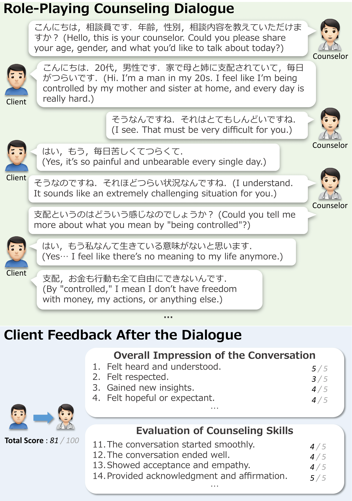
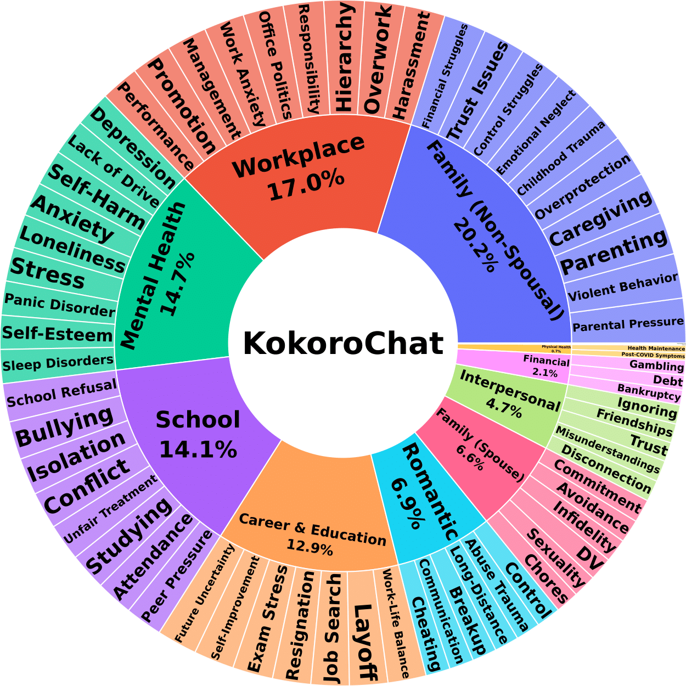

# KokoroChat: A Japanese Psychological Counseling Dialogue Dataset Collected via Role-Playing by Trained Counselors

**KokoroChat** is the largest human-collected Japanese psychological counseling dialogue dataset to date (as of June 2025). It was created through role-playing between trained counselors and includes rich, long-form dialogues and detailed client feedback on counseling quality. The dataset supports research on empathetic response generation, dialogue evaluation, and mental health-oriented language modeling.

This work has been **accepted to the main conference of ACL 2025**.
📄 [View Paper (PDF)](https://drive.google.com/file/d/1T6XgvZii8rZ1kKLgOUGqm3BMvqQAvxEM/view?usp=sharing)

## 🌟 Key Features

- 6,589 dialogues, collected between 2020 and 2024
- Avg. 91.2 utterances per dialogue
- 480 trained counselors simulating online text-based counseling sessions
- 20-dimension Likert-scale client feedback for every session
- Broad topic coverage: mental health, school, family, workplace, romantic issues, etc.

## 📊 Dataset Statistics

| Category                    | Total     | Counselor | Client    |
|----------------------------|-----------|-----------|-----------|
| **# Dialogues**            | 6,589     | -         | -         |
| **# Speakers**             | 480       | 424       | 463       |
| **# Utterances**           | 600,939   | 306,495   | 294,444   |
| **Avg. utterances/dialogue** | 91.20     | 46.52     | 44.69     |
| **Avg. length/utterance**  | 28.39     | 35.84     | 20.63     |

## 📁 Dataset Structure

Each sample contains:
- A full counseling dialogue with role labels (counselor / client) and message timestamps
- Structured client feedback on 20 dimensions (0–5 Likert scale)
- Flags for ethical concern checks (optional)
- Predicted topic label (automatically annotated by GPT-4o-mini)

👉 See [examples/dialogue_example.json](examples/dialogue_example.json) for a sample data instance.

## 📄 Citation

If you use this dataset, please cite the following paper:

bibtex
@inproceedings{qi2025kokorochat,
  title     = {KokoroChat: A Japanese Psychological Counseling Dialogue Dataset Collected via Role-Playing by Trained Counselors},
  author    = {Zhiyang Qi and Takumasa Kaneko and Keiko Takamizo and Mariko Ukiyo and Michimasa Inaba},
  booktitle = {Proceedings of the 63nd Annual Meeting of the Association for Computational Linguistics},
  year      = {2025},
  url       = {https://github.com/UEC-InabaLab/KokoroChat}
}

## ⚖️ License

KokoroChat is released under the **Creative Commons Attribution-NonCommercial-NoDerivatives 4.0 International (CC BY-NC-ND 4.0)** license.

This means:

- ✅ **Free to share** — You may copy and redistribute the material in any medium or format.
- ❌ **No commercial use** — You may not use the material for commercial purposes.
- ❌ **No modifications** — If you remix, transform, or build upon the material, you may not distribute the modified material.

📄 [View the full license text](https://creativecommons.org/licenses/by-nc-nd/4.0/)
